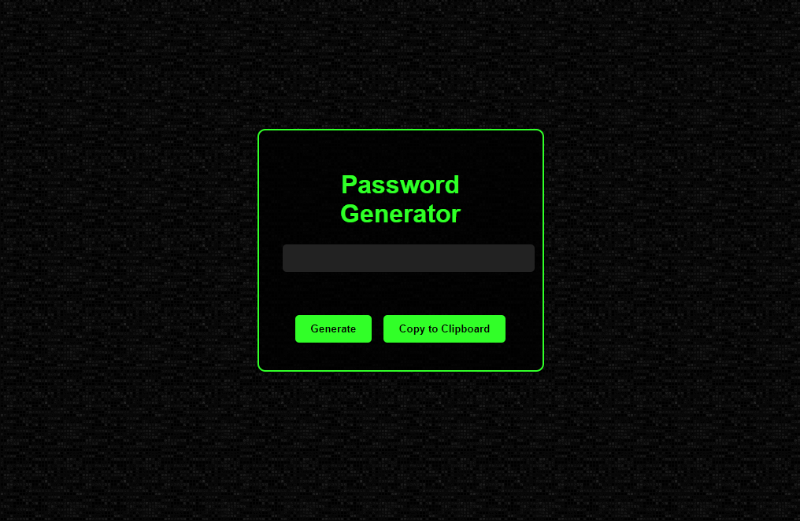

# Sci-Fi Themed Password Generator

A simple password generator with a sci-fi aesthetic. Generate random passwords and copy them to your clipboard with ease.

  

## Features
- Generate a random 12-character password
- One-click copy to clipboard
- Sci-fi theme with green and black colors

## How to Use

1. Open the `index.html` file in your preferred browser.
2. Click the "Generate" button to create a random password.
3. Click the "Copy to Clipboard" button to copy the generated password.

## Installation

1. Clone the repository or download the source code.
2. Navigate to the directory.
3. Open `index.html` in your browser.

## Contributing

Pull requests are welcome. For major changes, please open an issue first to discuss what you would like to change.

## License

[MIT](https://choosealicense.com/licenses/mit/)s

