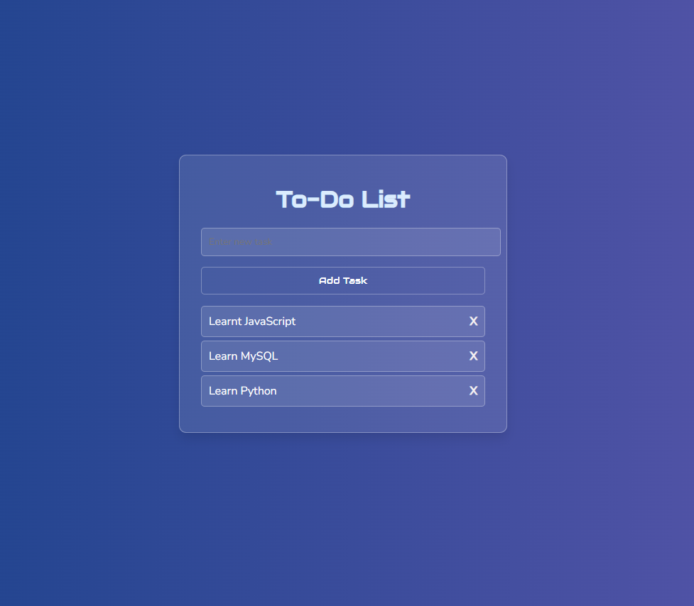

# To-Do List Application

A simple web-based To-Do List Application where users can add tasks, mark them as complete by deleting them, and have the tasks persisted in the browser using local storage.

## Features

- Add new tasks.
- Delete tasks.
- Tasks are saved in the browser's local storage.
- Responsive design.

## Setup

1. Download or clone the repository.
2. Open `index.html` in a browser.
3. Start adding tasks!

## Technologies Used

- HTML
- CSS
- JavaScript (with local storage)

